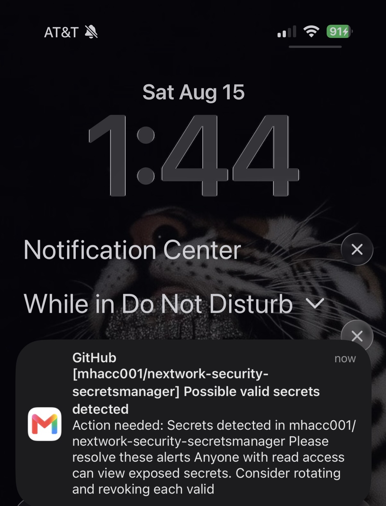

# Secure Secrets with AWS Secrets Manager

## Overview

In this project, I worked through the full lifecycle of a real credential leak: hardcoding AWS credentials into an application's source code, exposing that code publicly on GitHub, getting caught by GitHub's secret detection, fixing it properly with AWS Secrets Manager, and finally scrubbing the exposed credentials out of the repository's Git commit history entirely.

This project reinforced a core application security principle: fixing the *current* version of a file isn't enough if a secret was ever committed — it can still be recovered from history unless that history is explicitly rewritten.

## Services & Tools Used

- **AWS Secrets Manager** — securely stored and retrieved AWS credentials
- **AWS IAM** — access keys used to authenticate the sample application
- **GitHub** — hosted the code, forking, and secret scanning detection
- **Git** — version control, including interactive rebase and commit history rewriting
- **Python (boto3)** — SDK used to programmatically retrieve secrets

## What I Did

### 1. Set Up the Insecure Baseline
Cloned a sample FastAPI web app (`nextwork-security-secretsmanager`) that lists S3 buckets, and added example AWS credentials directly into `config.py` — the intentionally insecure starting point for this project.

### 2. Exposed the Credentials on GitHub
Forked the repository to my own GitHub account, then connected my local clone to the fork by setting the `origin` remote to my fork's URL.

Authenticated with GitHub via macOS Keychain when prompted, then staged, committed, and pushed the code containing the hardcoded credentials.

**Note:** GitHub's *push protection* (which blocks a push before it completes if it detects secrets) did not trigger on this push — likely because push protection wasn't enabled by default on my account/repository. However, GitHub's *post-push secret scanning* caught it shortly after: I received a real-time notification confirming "possible valid secrets detected" in the repository, with a follow-up email requesting the secret be rotated or revoked.

This was a valuable finding in itself — it demonstrated that GitHub's two detection layers (pre-push blocking vs. post-push scanning) don't always behave identically, and that scanning-after-the-fact is still a meaningful safety net even when blocking doesn't fire.

### 3. Created a Secret in AWS Secrets Manager
Stored the AWS credentials securely in Secrets Manager as a new secret (`aws-access-key`), using AWS's default managed encryption key.

### 4. Updated the Application to Use Secrets Manager
Rewrote `config.py` to fetch credentials at runtime via a `get_secret()` function using boto3, instead of storing them as plaintext variables.

### 5. Rewrote Git History to Remove the Leak
Pushing the updated (now-secure) `config.py` still didn't solve the underlying problem: the original commit containing hardcoded credentials was still recoverable from the repository's commit history. I first identified the exact commit to remove using `git log --oneline`, then used an interactive rebase to drop that specific commit from history entirely.

Dropping the commit created a merge conflict in `config.py`, since a later commit had also modified the same lines. I resolved the conflict by keeping only the Secrets Manager version of the code and discarding the old hardcoded version.

Since the commit history had been rewritten, a normal `git push` was rejected as non-fast-forward. I used `git push --force` to push the corrected history to my fork.

### 6. Verified the Fix on GitHub
Confirmed on GitHub that `config.py` no longer contains hardcoded credentials, and that the diff history shows the credentials being fully removed and replaced with the Secrets Manager retrieval code.

## Key Takeaways

- **Hardcoded credentials are a liability the moment they're committed** — not just when the code is made public. Anyone with access to the repository's history can recover them, even from an old commit that's no longer the current version of a file.
- **GitHub's secret detection has two distinct layers**: push protection (blocks before the push completes) and secret scanning alerts (flags after the push, via notification and the repo's Security tab). They can behave differently depending on account/repo settings, so neither should be treated as a guaranteed safety net — the real fix is never committing secrets in the first place.
- **AWS Secrets Manager decouples credentials from code.** Applications retrieve secrets at runtime via an authenticated API call instead of reading them from a static file, meaning the credential value itself never needs to touch source control.
- **Fixing the current file isn't enough — history matters.** Overwriting `config.py` in a new commit left the old, insecure commit fully intact and recoverable. Only an interactive rebase (`git rebase -i --root`) that explicitly dropped the offending commit actually removed it from the repository.
- **Rewriting history has real consequences**, like merge conflicts with subsequent commits and the need to force-push, since the rewritten history no longer matches what's on the remote. Both are manageable, but require care and a clear understanding of what's being overwritten.
- This project mirrors a real-world incident response workflow: detect exposure → rotate/secure the credential → remediate the exposure at its root (commit history), not just the surface-level symptom.
